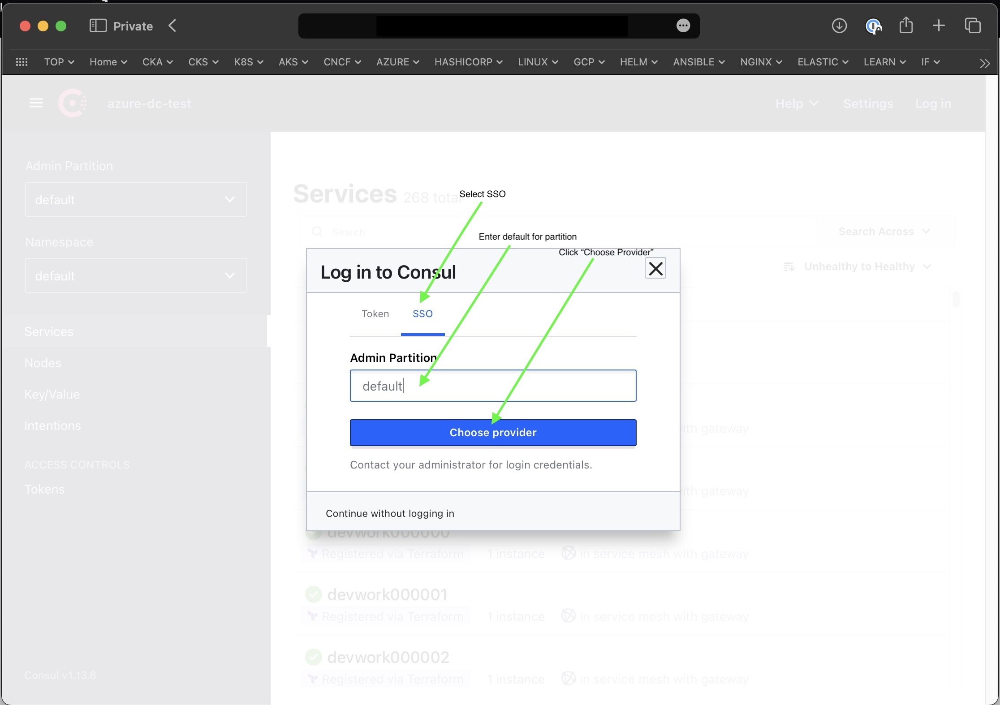

# Terraform modules to configure authentication with OIDC and Azure AD for Consul Enterprise (WORK IN PROGRESS - NOT READY FOR USE)

## Table of Contents

* [Description](#description)
* [Prerequisites](#prerequisites)
* [Configuration](#configuration)
  * [Modules](#modules)
  * [Variables](#variables)
    * [Variables for root module](#variables-for-root-module)
    * [Variables for azure-ad-app-for-oidc module](#variables-for-azure-ad-app-for-oidc-module)
    * [Variables for oidc-auth-method module](#variables-for-oidc-auth-method-module)
    * [Variables for oidc-auth-binding module](#variables-for-oidc-auth-binding-module)
* [Deployment](#deployment)
* [Usage](#usage)
* [Recommendations](#recommendations)
* [Cleanup](#cleanup)
* [Useful Documentation](#useful-documentation)

## Description

Repository contains Terraform modules to configure OIDC authentication method in Consul Enterprise using Azure AD as an identity provider.

## Prerequisites

* OIDC authentication is supported in Consul Enterprise only. Version 1.8.0 or later is required.
* Make sure you have appropriate permissions to create Azure AD applications and service principals.
* Admin consent is required for the application to access the Microsoft Graph API. This is required for the application to be able to read the user's profile information. The admin consent can be granted by an Azure AD global administrator or by a user with the Global Administrator role assigned in the Azure portal.
* Current configuration allows bind Azure AD groups to Consul ACL roles. Role will have a policy attached to it. Make sure you have appropriate permissions to create Azure AD security groups and ensure that token used to authenticate to Consul during the deployment has permissions to create ACL policies and roles.

## Configuration

### Modules

Solution contains the following modules:

* [root module](./main.tf) - loads other modules and sets variables for them.
* [azure-ad-app-for-oidc](./modules/azure-ad-app-for-oidc) - creates Azure AD application and service principal which will be used to configure OIDC authentication method in Consul.
* [oidc-auth-method](./modules/oidc-auth-method) - module to configure Consul OIDC authentication method.
* [oidc-auth-binding](./modules/oidc-auth-binding) - module used to bind Consul OIDC authentication method with ACL role and AAD group.

### Variables

#### Variables for root module

Variables for root module are defined in [variables.tf](./variables.tf) file and used in [main.tf](./main.tf) file. By default [variables.tf](./variables.tf) file contains variables required for consul terraform provider. However you may want to have a single `main.tf` file and deploy it with different with values specific to particular environment. For this you can add required variables to [variables.tf](./variables.tf) and create separate `variables.tfvars` file for each environment in [environments](./environments) folder. `variables.tfvars` file should contain values for variables defined in [variables.tf](./variables.tf) file (if default value is not set). Then when you loading modules in [main.tf](./main.tf) instead of setting values for variables directly you can pass you can set them as a variable from [variables.tf](./variables.tf) file. Typically `variables.tfvars` file contains only values for variables which are specific to particular environment.

Here is an example of how loaded module variables values are set directly in [main.tf](./main.tf) file:

```hcl
module "demo_azure_ad_app_for_oidc" {
  source = "./modules/azure-ad-app-for-oidc"
  azure_ad_app_name = "consul-oidc-demo-aad-app"
  azure_ad_app_owners = []
  azure_ad_app_redirect_uri = []
  azure_ad_app_access_token_issuance_enabled = true
  azure_ad_app_id_token_issuance_enabled = true
  azure_ad_app_group_membership_claims = ["All"]
}
```

Here is an example of how to pass values from variables defined in [variables.tf](./variables.tf) and `variables.tfvars` files:

```hcl
module "demo_azure_ad_app_for_oidc" {
  source = "./modules/azure-ad-app-for-oidc"
  azure_ad_app_name = var.azure_ad_app_name # 
  azure_ad_app_owners = var.azure_ad_app_owners 
  azure_ad_app_redirect_uri = var.azure_ad_app_redirect_uri
  azure_ad_app_access_token_issuance_enabled = var.azure_ad_app_access_token_issuance_enabled
  azure_ad_app_id_token_issuance_enabled = var.azure_ad_app_id_token_issuance_enabled
  azure_ad_app_group_membership_claims = var.azure_ad_app_group_membership_claims
}
```

Using this approach requires you to pass `-var-file` parameter to `terraform plan` and `terraform apply` commands. See deployment section for more details.

Name | Description | Type |
---- | ----------- | ---- |

#### Variables for azure-ad-app-for-oidc module

Name | Description | Type |
---- | ----------- | ---- |

#### Variables for oidc-auth-method module

Name | Description | Type |
---- | ----------- | ---- |

#### Variables for oidc-auth-binding module

Name | Description | Type |
---- | ----------- | ---- |

## Deployment

For demo purposes our [main.tf](./main.tf) loads all three modules and sets values for their variables directly. In order to have single main.tf file for all environments you can create separate `variables.tfvars` files in the [environments](./environments) folder and pass it to  [main.tf](./main.tf) module. This approach allows you to set different values for variables in different environments and have a single main.tf file.
In order to deploy the solution you need to run the following commands:

If simply setting values for module variables in [main.tf](./main.tf) file:

```bash
# Initialize Terraform
terraform init
# Plan the deployment
terraform plan 
# Apply configuration
terraform apply
```

If using `variables.tfvars` file assuming you are deploying to `dev` environment:

```bash
terraform init 
terraform plan -var-file=environments/dev/variables.tfvars
terraform apply -var-file=environments/dev/variables.tfvars
```

## Usage
Once the module is deployed AAD group members will be able to authenticate to Consul using OIDC and will be able to access resources based on the ACL policy attached to the role. Here is the step-by-step guide on how to login to Consul UI using OIDC and Azure AD:

1. Navigate to the Consul UI ([Consul Dev](consul-dev.balticit.ifint.bix) or [Consul Production](consul.balticit.ifint.biz)) and click on the "Login" button:


2. Then select SSO option and enter `default` in partition field and click OK:



3. Click on the "Continue with azure" button:


4. On the next screen you will be redirected to the Azure AD login page or you will be logged into consul automatically if you are already logged in.

P.S.
If you want to login as a different other than the one you are currently logged without logging it out you can start your browser in incognito/private mode and login as a different user.

P.P.S.
Token expiration time is to 5 minutes. If you are not using the token for 5 minutes it will expire and you will need to login again.
## Recommendations

## Cleanup

## Useful Documentation

[OpenID Connect (OIDC) Auth Method](https://developer.hashicorp.com/consul/docs/security/acl/auth-methods/oidc)

[Authenticate Users with Single Sign-On (SSO) and Auth0](https://developer.hashicorp.com/consul/tutorials/datacenter-operations/single-sign-on-auth0)